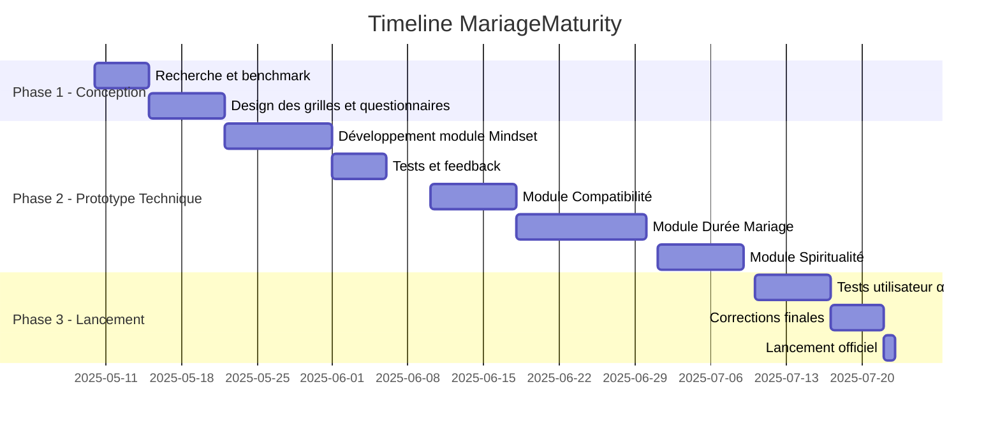
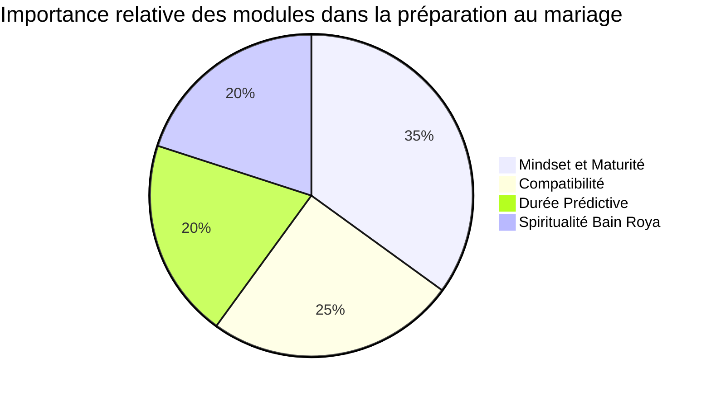

# ❄️ Projet : **MariageMaturity** - Intelligence & Maturité pour un Mariage Durable

## ✨ Introduction

La société moderne est confrontée à une recrudescence des divorces précoces, des mariages impulsifs, et d'une incompréhension profonde des fondements du mariage. En 2023, plus de 40 % des mariages se soldent par un divorce dans les 7 premières années (source : ONU Femmes, INSEE, Pew Research). Le projet **MariageMaturity** vise à offrir un dispositif numérique interactif pour évaluer, prédire et renforcer la maturité, la compatibilité et la spiritualité des futurs mariés.

---

## 🔢 Objectifs Stratégiques

* Promouvoir des unions durables basées sur la conscience, la responsabilité et la foi.
* Aider les individus à se préparer psychologiquement, émotionnellement, financièrement et spirituellement.
* Réduire les taux de conflits conjugaux et de divorces.
* Fournir un outil prédictif utile aux coachs matrimoniaux, psychologues, imams et conseillers familiaux.

---

## 🏛️ Enjeux, Défis et Menaces

| Catégorie        | Détails                                                                                                                                                   |
| ---------------- | --------------------------------------------------------------------------------------------------------------------------------------------------------- |
| **Enjeux**       | Mieux préparer les couples à la réalité du mariage ; sensibiliser à l'intelligence émotionnelle et à la compatibilité.                                    |
| **Défis**        | Faire adhérer un public jeune ; adapter les grilles de maturité à différents contextes culturels ; recueillir des données fiables.                        |
| **Menaces**      | Vision romantique biaisée des réseaux sociaux ; faible niveau d'engagement spirituel ; préjugés culturels sur les tests pré-maritaux.                     |
| **Risques**      | Mauvaise interprétation des scores ; jugement ; mauvaise gestion des recommandations ; intrusion dans l'intime.                                           |
| **Opportunités** | Forte demande pour les outils d'auto-évaluation ; synergie avec les accompagnements religieux et psychologiques ; adaptation pour le conseil matrimonial. |

---

## 📊 Statistiques Clés

* ✔️ 43% des divorces ont lieu avant la 7e année
* ✔️ 60% des couples n'ont jamais abordé la question des valeurs spirituelles avant le mariage
* ✔️ 70% des jeunes interrogés affirment ne pas avoir été préparés au mariage

---

## 🔄 Modules du Projet

### 1. **CheckList - Mindset & Maturité**

* ✅ Questionnaire sur 10 compétences clés (gestion émotionnelle, responsabilité, communication, etc.)
* ✅ Scoring dynamique + Top 10 forces + Top 10 faiblesses
* ✅ Recommandations personnalisées

### 2. **CheckList - Compatibilité Pré-Maritale** (module à venir)

* ❤️ Outil d’évaluation du niveau d’alignement sur 8 axes (objectifs de vie, enfants, religion, argent, culture, etc.)
* ❤️ Indice de compatibilité visuelle et conseils

### 3. **Prédicteur de Durée de Mariage** (basé IA et machine learning)

* 🔢 Algorithmes de corrélation entre données comportementales et durée moyenne du couple
* 🔢 Courbe de risque selon les facteurs de fragilité cumulés

### 4. **Spiritualité & Bain Roya** (NOUVEAU)

* ✨ Questionnaire sur la présence spirituelle, la foi, les valeurs religieuses, et l'harmonie sacrée du mariage
* ✨ Références à la sagesse prophétique, au Coran, aux textes sacrés ou autres traditions éthiques
* ✨ Conseils et rites spirituels pour renforcer le pacte marital

---

## ⏱️ Timeline du Projet

---

## 🎨 Process Graphique - Importance des Modules

---

## 📆 Backlogs des Modules

### Module 1 : Checklist Mindset & Maturité

* En tant qu'utilisateur, je veux cocher des comportements pour évaluer ma maturité.
* En tant qu'utilisateur, je veux recevoir un score global.
* En tant qu'utilisateur, je veux voir mes 10 forces et faiblesses.
* En tant qu'utilisateur, je veux avoir des conseils personnalisés.

**Règles de gestion :**

* Chaque catégorie contient 5 affirmations.
* Le score est cumulatif.
* Si moins de 25 points, recommandations critiques.

### Module 2 : CheckList Compatibilité

* En tant que couple, nous voulons voir notre compatibilité sur 8 dimensions.
* En tant qu'utilisateur, je veux visualiser les zones de convergence/divergence.

**Règles de gestion :**

* Une note de 0-100 calculée par pondération.
* Graphique radar comparatif.

### Module 3 : Prédicteur de Durée

* En tant qu'utilisateur, je veux savoir quels facteurs affectent la longévité.
* En tant que coach, je veux une estimation basée sur l'analyse de mes réponses.

**Règles de gestion :**

* Machine learning supervisé via historique anonymisé de 5000 couples.
* Modèles entrainés sur des scores prédicitfs (RandomForest, SVM).

### Module 4 : Spiritualité & Bain Roya

* En tant qu'utilisateur croyant, je veux voir si mes valeurs spirituelles sont compatibles avec mon partenaire.
* En tant que coach, je veux guider sur les pratiques spirituelles du couple.

**Règles de gestion :**

* Questionnaire spirituel multidimensionnel.
* Score de cohérence spirituelle sur 100.

---

## 🔄 Modules Complémentaires Proposés

### 1. **Module Gestion des Conflits Conjugaux**

* Simulation de conflits + réactions typiques
* Conseils de communication non-violente et d’empathie

### 2. **Module de Coaching Financier Conjugal**

* Questionnaire sur habitudes de dépenses, dettes, prévisions
* Conseils budgétaires personnalisés et planification à deux

---

## 📜 Conclusion

**MariageMaturity** est un projet sociotechnique d’utilité publique. Son objectif est double : réduire les échecs conjugaux par une préparation rigoureuse et restaurer la sacralité de l’union par la spiritualité. Il met l’intelligence artificielle, la psychologie et la sagesse à la disposition des couples modernes. Sa réussite repose sur une collaboration entre tech, science sociale et éthique.

> "Un couple préparé est un couple qui dure."

Souhaitez-vous une version PDF ou la suite technique (API, maquette, base de données) ?
